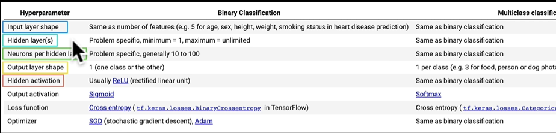
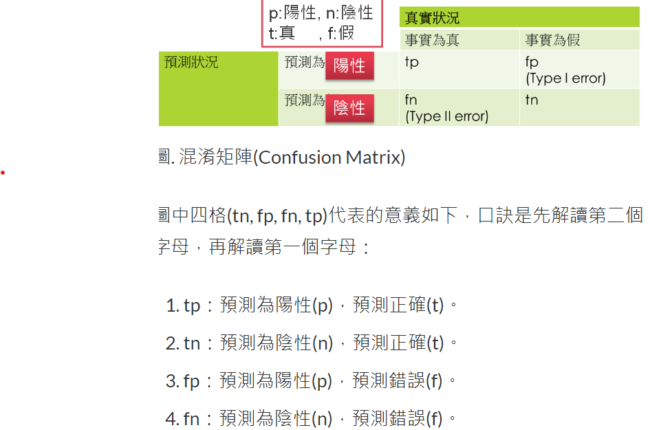
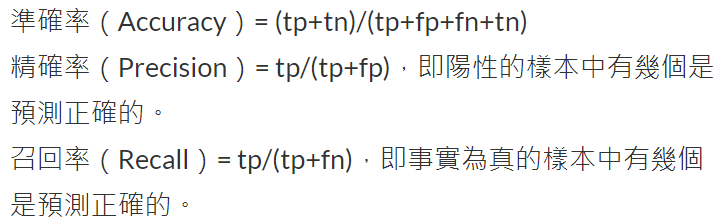

# Regression

* training experiment (tooltips)
  * increase neuron (increase complexity to learn feature in on layer)
  * increase dense layer (increase complexity to learn feature in whole model)
  * optimizer:
    * Adjust learning rate (lr)
    * change optimizer, Adam converage faster than SGD
  * input data preprocess:
    * normalization in scikit learn
   

----

# classification



[recipe for training neural network](https://karpathy.github.io/2019/04/25/recipe/)

* use early stop callback to find the best learning rate

````
tf.random.set_seed(42)

model9=tf.keras.Sequential([
    tf.keras.layers.Dense(4, activation="relu"),
    tf.keras.layers.Dense(4, activation="relu"),
    tf.keras.layers.Dense(1, activation="sigmoid")
])

model9.compile(loss="binary_crossentropy",
               optimizer="Adam",
               metrics=["accuracy"])

lrcb=tf.keras.callbacks.LearningRateScheduler(lambda epoch: 1e-4*10**(epoch/20))

his = model9.fit(x_train,y_train, epochs=100,callbacks=[lrcb])
````

````
pd.DataFrame(his.history).plot(figsize=(10,7), xlabel="epochs")
````

````
lrs=1e-4*(10**(tf.range(100)/20))
plt.figure(figsize=(10,7))
plt.semilogx(lrs,his.history["loss"])
plt.xlabel("learning rate")
plt.ylabel("loss")
````

find the learning rate where the loss to be the lowest





----

* ML model baseline is start from the simple one, then add complexity to beat baseline
* padding = "valid", means output tensor would shrink, otherwise output be the same shape
* batch_size = 32, is experience size
* radom.set_seed(42), is experience

> When a model's **validation loss starts to increase**, it's likely that the model is overfitting the training dataset

### induce overfitting:
* increase number of conv layers
* increase number of filters
* add another dense layer to the output of our flattened layer

### reduce overfitting:
* add data augmentation
* add regularization layers (such as MaxPool2D)
  * MaxPool2D: use the rolling window to preserve the most significant features
* add more data


### Shuffle augemented data v.s. augemented data
>  shuffle generate randomness on data to make model learn more generally to unseen data
> make model to learn equally on different kinds of data

### optimization direction in CNN

* deeper layers
* wider neurons
* best learning rate
* train more epochs
* more data
* transfer learning


### Step to create data set for multiclass classification

* ImageDataGenerator
  * can use data augmentation here
* flow from directory

### Callbacks
* TensorBoard callback
* ModelCheckpoint callback
* EarlyStopping callback
  * aim to find best epochs

### Funtional API

It is better to explore tensors layer by layer

> If it is a layer, put input x outside the bracket
> ex. GlobalAveragePooling2D()(x)

> If it is a model, put input x inside the bracket
> ex. base_model(x)

````
base_model = tf.keras.applications.efficientnet_v2.EfficientNetV2B0(include_top=False)

base_model.trainable = False

inputs = tf.keras.layers.Input(shape=(224,224,3), name="input_layer")

# x = tf.keras.layers.experimental.preprocessing.Rescale(1./255)(inputs)

x = base_model(inputs)
print(f"Shape after passing inputs through base model:{x.shape}")

x = tf.keras.layers.GlobalAveragePooling2D(name="global_average_pooling_kayrt")(x)
print(f"Shape after GlobalAveragePooling2D:{x.shape}")

outputs = tf.keras.layers.Dense(10, activation="softmax", name="output_layer")(x)

model0 = tf.keras.Model(inputs, outputs)

model0.compile(loss="categorical_crossentropy",
               optimizer=tf.keras.optimizers.Adam(),
               metrics=["accuracy"])

his0 = model0.fit(train_data_10_percent,
                  epochs=5,
                  steps_per_epoch=len(train_data_10_percent),
                  validation_data=test_data,
                  validation_steps=int(0.25*len(test_data)),
                  callbacks=[create_tensorboard_callback("transfer_learning",
                                                         "10_percent_feature_extraction")]
                  )
````

### preprocessing layer can do data augementation in GPU

````
import tensorflow as tf
from tensorflow import keras
from tensorflow.keras import layers
from tensorflow.keras.layers.experimental import preprocessing

data_aug = keras.Sequential([
    preprocessing.RandomFlip("horizontal"),
    preprocessing.RandomRotation(0.2),
    preprocessing.RandomZoom(0.2),
    preprocessing.RandomHeight(0.2),
    preprocessing.RandomWidth(0.2),
    preprocessing.Rescaling(1./255)
], name="data_aug")
````

````
import tensorflow as tf
from tensorflow.keras.layers import Input, Dense, GlobalAveragePooling2D
#define base model
base_model = tf.keras.applications.EfficientNetB0(include_top=False)
base_model.trainable = False

#define inputs

inputs = Input(shape=(224,224,3), name="inputs")

x = data_aug(inputs)

x = base_model(x, training=False)

x = GlobalAveragePooling2D()(x)

outputs = Dense(10, activation="softmax", name="outputs")(x)

#define outputs
model2 = tf.keras.Model(inputs=inputs, outputs=outputs)

model2.compile(loss="categorical_crossentropy",
               optimizer=tf.keras.optimizers.Adam(),
               metrics=["accuracy"])

his2=model2.fit(
    train_data_10_percent,
    epochs=5,
    steps_per_epoch=len(train_data_10_percent),
    validation_data=test_data,
    validation_steps=len(test_data),
)
````

### In fine tunning, we better lower the learning rate to 10x

* unfreeze the last 5 layers
````
base_model.trainable = True
for layer in base_model.layers[:-5]:
  layer.trainable = False
````